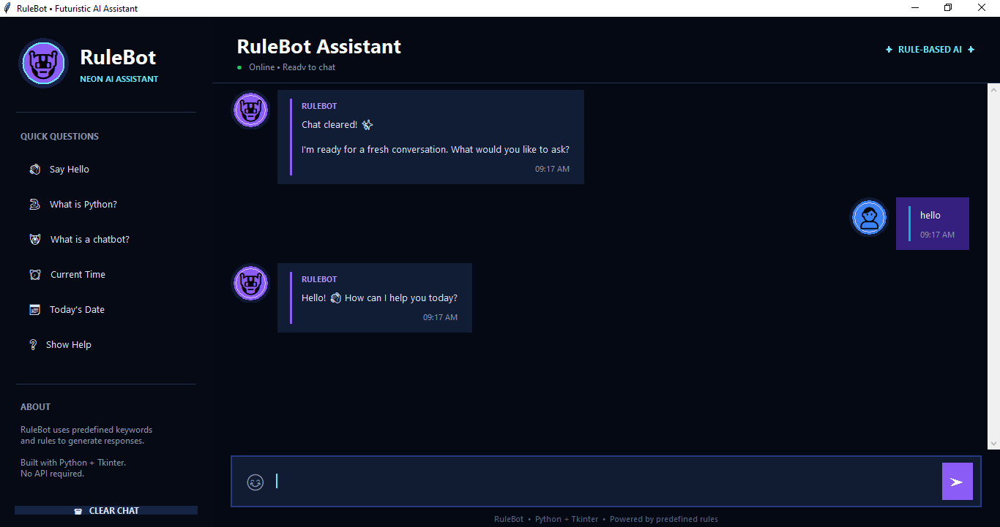

🤖 RuleBot — Rule-Based Chatbot

A modern desktop chatbot built with Python and Tkinter, combining simple rule-based conversational logic with a polished, futuristic user interface.

📌 Overview

RuleBot is a lightweight rule-based chatbot application developed using Python and Tkinter.

Unlike AI or machine-learning chatbots, RuleBot uses predefined rules and keyword matching to determine appropriate responses. The project demonstrates how conversational interfaces can be implemented using fundamental Python concepts while maintaining a modern and user-friendly desktop experience.

The application features a futuristic neon interface, gradient background, chat bubbles, circular avatars, quick-action buttons, timestamps, and a responsive chat area.

🧠 How It Works

RuleBot follows a simple keyword-matching approach.

Processing Flow
User Input
    │
    ▼
Convert Input to Lowercase
    │
    ▼
Check Predefined Rules
    │
    ├── Match Found ──────► Return Matching Response
    │
    └── No Match ─────────► Return Default Response

🚀 Installation
Step 1 — Install Python

Install Python 3.x on your system.

Verify the installation:

python --version

or:

python3 --version

Step 2 — Clone the Repository
git clone <YOUR_REPOSITORY_URL>

Navigate into the project:

cd RuleBot

Step 3 — Verify Tkinter

Run:

python -m tkinter

If a Tkinter window opens successfully, the GUI framework is ready.

Step 4 — Run the Application
python chatbot.py

On systems where python3 is required:

python3 chatbot.py

📦 Requirements

The project does not require external packages.

requirements.txt:

# RuleBot
# No external dependencies required.
# Tkinter is provided with standard Python installations.

🔒 Privacy

RuleBot does not require:

User accounts

API keys

Cloud services

External servers

Internet access

Database storage

All chatbot processing occurs locally within the Python application.

📊 Project Information
Property	Details
Project Name	RuleBot
Project Type	Desktop Chatbot
Chatbot Type	Rule-Based
Programming Language	Python
GUI Framework	Tkinter
Architecture	Keyword/Rule-Based
External API	None
Database	None
Internet Required	No
Current Status	Completed
🤝 Contributing

Contributions and improvements are welcome.
